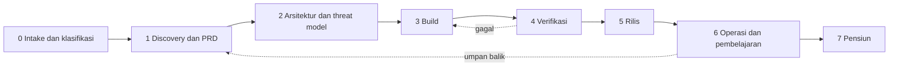

# Software Development Life Cycle (SDLC)

Dokumen ini menetapkan alur hidup perubahan dari ide sampai pensiun, beserta gate, bukti, dan pemilik tiap fase. Dokumen ini netral terhadap metodologi (Scrum, Kanban, dll.) dan stack; yang diwajibkan adalah **gate dan bukti**, bukan seremoni. Detail tiap kontrol berada di dokumen kanonis yang ditautkan; dokumen ini tidak menduplikasi persyaratannya.

## Prinsip

- Setiap perubahan MUST dapat ditelusuri dari kebutuhan (PRD/feature spec) sampai tes, pull request, rilis, dan pemantauan.
- Kedalaman fase mengikuti [tier risiko](../00-governance/README.md#tingkat-risiko) dan jenis perubahan. Fase boleh dipadatkan untuk Tier 3, tetapi gate dan bukti minimumnya tidak dihapus.
- Keputusan lolos/tidak pada setiap gate diambil melalui [decision layer JEV](decision-layer-jev.md); pemeriksaan otomatis dipasang sebagai [guardrails](guardrails.md).
- Keamanan, privasi, aksesibilitas, dan operabilitas adalah bagian dari definisi selesai, bukan fase tambahan di akhir.
- Gate yang gagal atau tidak dapat dijalankan dilaporkan sebagai **belum terverifikasi**, bukan lulus.

## Gambaran alur

## Fase, aktivitas, dan gate

| Fase | Aktivitas minimum | Gate keluar (bukti) | Pemilik utama | Dokumen kanonis |
| --- | --- | --- | --- | --- |
| 0. Intake dan klasifikasi | Tetapkan tujuan, owner, klasifikasi data, tier, dan jenis perubahan (standar/normal/darurat). | Tier dan owner tercatat dengan alasan. | Product/business owner | [Tata kelola](../00-governance/README.md), [profil organisasi](../00-governance/organization-profile-template.md) |
| 1. Discovery dan PRD | Validasi masalah dengan bukti, tulis PRD dan acceptance criteria, identifikasi data, aktor, dan kewajiban hukum/kontrak. | PRD lolos [Definition of Ready](../03-product/prd-readiness-checklist.md); pertanyaan terbuka punya pemilik. | Product owner | [PRD](../03-product/prd-template.md), [feature spec](../03-product/feature-spec-template.md) |
| 2. Arsitektur dan threat model | Pilih dan catat arsitektur, trust boundary, data flow, failure mode; threat model sesuai tier; rencana migrasi dan rollback. | ADR/rekomendasi arsitektur disetujui; threat model dan mitigasi terlacak. | Engineering owner, security owner | [Pemilihan arsitektur](../04-architecture/architecture-selection-guide.md), [ADR](../04-architecture/adr-template.md), [threat model](../02-security/threat-model-template.md) |
| 3. Build | Implementasi sesuai standar; branch terlindungi; guardrails aktif di workspace, agent, dan CI. | PR fokus, lolos quality gates, ditinjau independen. | Engineering owner | [Coding standards](coding-standards.md), [Git dan review](git-and-code-review.md), [AI-assisted dev](ai-assisted-development.md) |
| 4. Verifikasi | Tes fungsional dan negatif, secret/SCA/SAST, deteksi defect dan debt, accessibility, uji pemulihan sesuai tier. | Hasil pemeriksaan tertaut ke commit; temuan di-triage dan di-retest. | Engineering, security owner | [Testing dan gates](testing-and-quality-gates.md), [deteksi defect/debt](defect-and-debt-detection.md), [vulnerability management](../02-security/vulnerability-management.md) |
| 5. Rilis | Keputusan rilis (JEV), approval sesuai tier, rollout bertahap, rollback siap, SBOM/provenance sesuai tier. | Catatan rilis dan keputusan tersimpan; artefak tertelusur ke source. | Engineering owner, risk owner | [Release management](../06-operations/environments-and-release-management.md), [regulated change](../06-operations/regulated-change-management.md) |
| 6. Operasi dan pembelajaran | Pantau SLI/SLO, tangani insiden, ukur metrik PRD, tinjau debt dan risiko, tinjau akses. | Metrik pasca-rilis dilaporkan; insiden punya post-incident review. | Engineering owner, product owner | [Reliability](../06-operations/reliability-backup-and-recovery.md), [logging dan insiden](../02-security/logging-monitoring-and-incidents.md), [runbook](../06-operations/runbook-template.md) |
| 7. Pensiun | Rencana migrasi pengguna, penghapusan/retensi data, pencabutan kredensial dan akses, pembersihan dependency/vendor. | Bukti penghapusan dan pencabutan; aset di inventori ditutup. | Product dan engineering owner | [Retensi data](../02-security/data-retention-schedule-template.md), [third-party risk](../02-security/third-party-risk.md) |

## Gate menurut tier

Tier yang lebih tinggi mewarisi gate tier di bawahnya. Nilai ambang (mis. tenggat) ditetapkan di profil organisasi, bukan di dokumen ini.

| Gate | Tier 3 | Tambahan Tier 2 | Tambahan Tier 1 |
| --- | --- | --- | --- |
| PRD dan acceptance criteria | Ringkas, tetap tertulis | Review security/privacy atas PRD | Persetujuan product, engineering, dan security |
| Arsitektur dan threat model | Catatan keputusan singkat | Threat model proporsional | Threat model dan review arsitektur independen |
| Review kode | Satu reviewer non-author | Reviewer domain untuk area sensitif | Dua reviewer, satu domain/security owner |
| Verifikasi | Gates CI baseline | Review keamanan sebelum rilis material | Security assessment independen, uji pemulihan terjadwal |
| Keputusan rilis | Engineering owner | Engineering owner + security untuk perubahan sensitif | Engineering, product/risk, dan security owner; kelas keputusan D3 |
| Pasca-rilis | Pantau alert | Review metrik dan debt | Post-implementation review, tabletop/restore sesuai jadwal |

## Jenis perubahan

- **Standar**: pola berulang berisiko rendah dengan prosedur dan bukti yang sudah disepakati; boleh dipercepat melalui guardrails dan keputusan kelas rendah.
- **Normal**: seluruh fase di atas sesuai tier.
- **Darurat**: mengikuti [emergency change](git-and-code-review.md#emergency-change); pemeriksaan minimum tetap dijalankan dan review retrospektif dicatat. Perubahan darurat tidak dapat melewati kewajiban hukum/kontrak.

## Keterlacakan

Pertahankan rantai ID: kebutuhan (`FR-xx`) → acceptance criteria → tes → PR → build/rilis → metrik pasca-rilis. PR menautkan ID kebutuhan, dan PRD memuat matriks keterlacakan. Temuan defect, vulnerability, dan debt menautkan ID kebutuhan atau komponen yang terdampak.

## Peran AI dalam SDLC

Coding agent boleh membantu di fase mana pun sesuai [AI-assisted development](ai-assisted-development.md), dengan batas: agent tidak menjadi satu-satunya pemberi persetujuan gate, bukti verifikasi berasal dari eksekusi nyata, dan tindakan berdampak tinggi mengikuti kelas keputusan [JEV](decision-layer-jev.md).

## Tailoring dan pengukuran

- Proyek MAY menyesuaikan fase untuk metodologinya; catat pemetaan fase dan gate di `docs/engineering/standards.md`. Pengurangan gate MUST memakai [pengecualian](../00-governance/exception-template.md).
- Ukur alur dan stabilitas (mis. lead time perubahan, frekuensi rilis, kegagalan perubahan, waktu pemulihan) sebagai sinyal perbaikan proses, bukan target individu. Tetapkan ambang berdasarkan baseline proyek.
- Tinjau efektivitas SDLC setelah insiden besar dan sekurangnya setahun sekali.
