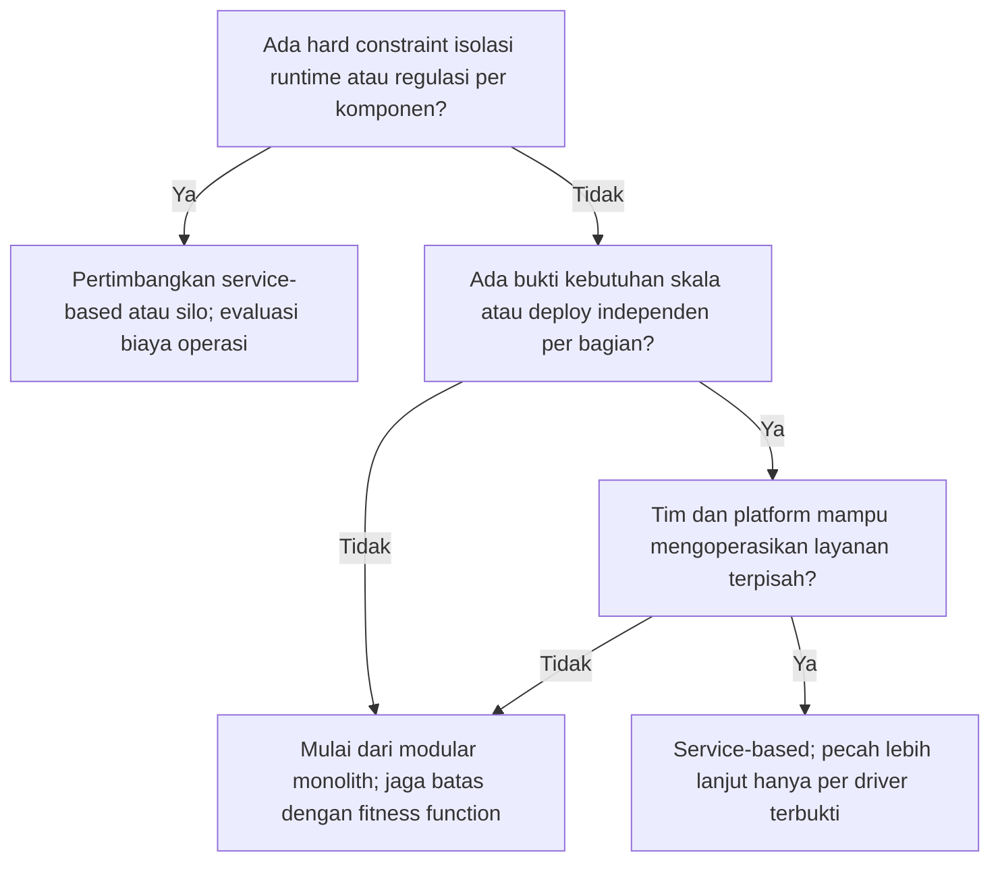

# Panduan Pemilihan dan Rekomendasi Arsitektur

Handbook ini **tidak menetapkan satu arsitektur untuk semua proyek**. Dokumen ini memberi cara terstruktur bagi tim yang mengadopsi handbook (atau agent yang membantu mereka) untuk merekomendasikan arsitektur yang cocok dengan konteks proyek, lalu mencatatnya sebagai keputusan yang dapat diaudit dan ditinjau ulang.

Hasil proses ini adalah **Architecture Recommendation Record** yang berujung pada [ADR](adr-template.md). Rekomendasi adalah masukan keputusan; persetujuan tetap di tangan engineering owner dan, untuk Tier 1, security serta risk owner.

## Prinsip

- Mulai dari **struktur paling sederhana yang memenuhi hard constraint dan quality attribute prioritas**. Pindah ke bentuk lebih terdistribusi (SHOULD) hanya bila ada driver yang terbukti, bukan tren atau antisipasi spekulatif.
- Arsitektur dipilih dari **driver** (tujuan, kendala, atribut kualitas), bukan dari teknologi favorit.
- Selalu bandingkan sedikitnya dua kandidat, termasuk "tetap dengan yang ada" atau opsi paling sederhana.
- Nyatakan apa yang **tidak diketahui**; rekomendasi dengan asumsi besar diberi tingkat keyakinan rendah dan pemicu tinjau ulang.
- Rekomendasi dibuat melalui [JEV](../01-engineering/decision-layer-jev.md): dinilai (Judge), dievaluasi terhadap kriteria dan skenario (Evaluate), diverifikasi reviewer independen (Verify).

## Langkah

### 1. Kumpulkan driver

Isi tabel ini dari PRD dan profil organisasi. Kolom yang kosong ditulis "tidak diketahui", bukan ditebak.

| Driver | Pertanyaan |
| --- | --- |
| Tier dan data | Tier berapa? Klasifikasi data, residency, kewajiban hukum/kontrak? |
| Atribut kualitas | Urutkan prioritas: keamanan, keandalan/ketersediaan, performa dan skala, modifiabilitas, kemudahan operasi, portabilitas, aksesibilitas, biaya. Gunakan karakteristik [ISO/IEC 25010:2023](https://www.iso.org/standard/78176.html) sebagai kosakata. |
| Domain dan batas | Seberapa stabil batas domain? Bagian mana berubah dengan laju berbeda? |
| Skala dan beban | Profil beban (stabil, bursty, musiman), ketidakpastian pertumbuhan, kebutuhan skala independen per bagian? |
| Tim dan organisasi | Jumlah tim, keterampilan, kepemilikan, kapasitas on-call dan operasi? |
| Integrasi | Sistem lama, API pihak ketiga, protokol, batas latensi dan ketersediaan? |
| Data | Konsistensi (kuat/eventual), volume, pola baca/tulis, auditability, retensi? |
| Operasi | Kematangan CI/CD, observability, IaC, kemampuan pemulihan? |
| Kendala bisnis | Anggaran, tenggat, vendor yang disyaratkan, risiko lock-in, rencana keluar? |
| Sistem yang ada | Apa yang sudah berjalan dan tidak boleh dirusak? Utang yang diwarisi? |

### 2. Saring dengan hard constraint

Hapus kandidat yang melanggar kendala tak dapat ditawar (mis. residency data, isolasi regulasi, batas operasi tim, ketersediaan vendor). Catat alasan penghapusan.

### 3. Susun kandidat

Pilih dua sampai empat kandidat dari katalog di bawah atau variasi di antaranya.

### 4. Evaluasi dengan skenario

Untuk atribut kualitas teratas, tulis **skenario konkret** (stimulus → respons yang diharapkan) dan nilai tiap kandidat terhadapnya secara kualitatif dengan alasan, termasuk kegagalan: apa yang terjadi saat komponen, jaringan, atau dependency gagal; bagaimana rollback; bagaimana data dipulihkan. Hindari skor angka berbobot yang menyembunyikan asumsi.

### 5. Rekomendasikan dan catat

Tulis [Architecture Recommendation Record](#template-architecture-recommendation-record), jalankan JEV, lalu catat keputusan final sebagai ADR beserta *fitness function* (pemeriksaan otomatis yang menjaga keputusan tetap berlaku, mis. aturan dependensi antar modul, batas latensi, tes isolasi tenant) dan **pemicu tinjau ulang**.

## Katalog gaya arsitektur

Katalog ini orientasi, bukan daftar lengkap. Tidak ada gaya yang unggul universal.

| Gaya | Cocok bila | Hindari / waspada bila | Risiko dan biaya utama |
| --- | --- | --- | --- |
| Monolit berlapis | Domain kecil dan jelas, tim kecil, kecepatan awal penting | Beberapa tim berebut satu codebase, kebutuhan skala bagian-bagian berbeda | Kopling membesar jika batas tidak dijaga |
| **Modular monolith** | Domain belum stabil atau tim kecil-menengah; ingin batas jelas tanpa biaya operasi terdistribusi | Kebutuhan isolasi runtime/regulasi per modul atau skala independen yang terbukti | Disiplin batas modul harus ditegakkan (fitness function), bukan hanya konvensi |
| Service-based (beberapa layanan kasar) | Beberapa domain berbeda laju/skala, tim terpisah, tapi belum perlu puluhan layanan | Tim tidak siap mengoperasikan banyak deploy | Transaksi lintas layanan, versioning kontrak |
| Microservices | Banyak tim otonom, domain stabil dan terpisah, kebutuhan skala/isolasi kegagalan per layanan yang terbukti, platform dan observability matang | Tim kecil, domain belum jelas, tanpa platform dan on-call matang | Biaya operasi, konsistensi data, latensi jaringan, kompleksitas pengujian dan keamanan antar-layanan |
| Event-driven / messaging | Alur asinkron, decoupling produsen-konsumen, beban bursty, integrasi banyak pihak | Butuh konsistensi kuat dan alur sinkron sederhana | Urutan, duplikasi, idempotency, debugging alur, skema event |
| Serverless / FaaS | Beban sporadis/bursty, tim ingin minim operasi infrastruktur, tugas pendek tanpa state | Beban stabil tinggi (biaya), latensi ketat, ketergantungan vendor tidak dapat diterima | Lock-in, batas runtime, observability, cold start |
| CQRS / event sourcing | Audit penuh, riwayat sebagai fakta bisnis, model baca dan tulis sangat berbeda | CRUD sederhana, tim belum berpengalaman | Kompleksitas tinggi, evolusi skema event, rekonstruksi state |
| Batch / pipeline data | Pemrosesan terjadwal volume besar, analitik, rekonsiliasi | Kebutuhan latensi rendah per kejadian | Penjadwalan, backfill, kualitas dan lineage data |
| Client-heavy (SPA/mobile) + BFF/API | Interaksi kaya, beberapa klien dengan kebutuhan berbeda | Logika bisnis atau otorisasi dipindah ke klien | Otorisasi harus server-side; versi klien lama; offline sync |
| Multi-tenant: pooled / silo / hybrid | Pooled: banyak tenant kecil, efisiensi biaya. Silo: isolasi kuat, regulasi, tenant besar. Hybrid: tingkat layanan berbeda | Pooled tanpa kontrol isolasi teruji; silo tanpa otomasi operasi | Kebocoran lintas tenant, biaya, noisy neighbor, migrasi tenant |

Pola internal seperti hexagonal/ports-and-adapters atau clean architecture MAY dipakai di dalam gaya apa pun untuk memisahkan aturan bisnis dari infrastruktur; mereka bukan gaya deployment.

## Panduan awal keputusan

Pohon berikut adalah heuristik awal, bukan hukum. Hasilnya tetap dievaluasi di langkah 4.



Beban asinkron/bursty menambahkan opsi event-driven atau serverless pada bagian terkait, bukan seluruh sistem secara otomatis.

## Implikasi per tier

- **Tier 3**: pilihan sederhana dan catatan keputusan singkat sudah cukup; tetap tulis driver dan alasan.
- **Tier 2**: threat model proporsional atas kandidat terpilih; rencana operasi, backup, dan observability menjadi bagian evaluasi.
- **Tier 1**: review arsitektur independen, threat model lengkap, desain pemulihan dan isolasi dibuktikan, keputusan kelas D3.

## Anti-pola

- **Resume-driven** atau mengikuti tren tanpa driver.
- **Microservices prematur**: memecah sebelum batas domain stabil atau sebelum ada platform dan observability.
- **Menyalin arsitektur perusahaan besar** tanpa skala, tim, dan anggaran yang sama.
- Mengabaikan kapasitas tim dan operasi dalam evaluasi.
- Memilih teknologi tanpa rencana keluar atau tanpa menilai lock-in.
- Rekomendasi tanpa alternatif, tanpa asumsi tertulis, atau tanpa pemicu tinjau ulang.
- Memindahkan otorisasi atau validasi ke klien.

## Rekomendasi oleh agent AI

Agent boleh menyusun rekomendasi, dengan aturan: baca dokumen proyek (PRD, ADR, README, profil organisasi) sebelum menyarankan; sebutkan driver yang diketahui dan yang tidak diketahui; jangan menyatakan kecocokan tanpa menautkannya ke driver; tandai asumsi; dan serahkan ke verifier manusia independen sebelum menjadi ADR. Rekomendasi tanpa data driver dilaporkan sebagai usulan awal berkeyakinan rendah.

## Template Architecture Recommendation Record

```markdown
# Rekomendasi Arsitektur: [sistem/fitur]

- Tanggal, penyusun (manusia/agent), reviewer independen:
- Tier dan klasifikasi data:
- PRD / dokumen sumber:

## Driver dan kendala
- Tujuan bisnis dan atribut kualitas prioritas (urut):
- Hard constraint (hukum, kontrak, residency, vendor, operasi):
- Tim, kapasitas operasi, dan kematangan platform:
- Yang tidak diketahui dan asumsi:

## Kandidat
| Kandidat | Ringkasan | Dihapus oleh hard constraint? (alasan) |
| --- | --- | --- |

## Evaluasi skenario
| Skenario (stimulus → respons) | Kandidat A | Kandidat B | Catatan kegagalan dan pemulihan |
| --- | --- | --- | --- |

## Rekomendasi
- Pilihan dan alasan terkait driver:
- Trade-off yang diterima:
- Tingkat keyakinan (tinggi/sedang/rendah) dan alasan:
- Reversibilitas dan biaya berpindah:
- Fitness function dan bukti yang akan dipakai:
- Pemicu tinjau ulang (mis. perubahan skala, tim, regulasi, insiden):
- Risiko dan mitigasi (tautan risk register / threat model):

## Keputusan JEV
- Kelas (D0–D4), verdict, verifier, tanggal:
- ADR terkait:
```

## Rujukan

- [ISO/IEC 25010:2023 Product quality model](https://www.iso.org/standard/78176.html) — kosakata atribut kualitas (diterbitkan November 2023).
- [NIST SP 800-160 Vol. 1 Rev. 1: Engineering Trustworthy Secure Systems](https://csrc.nist.gov/pubs/sp/800/160/v1/r1/final) — prinsip rekayasa sistem aman (November 2022).
- [Architecture overview template](architecture-overview-template.md) dan [ADR template](adr-template.md).
